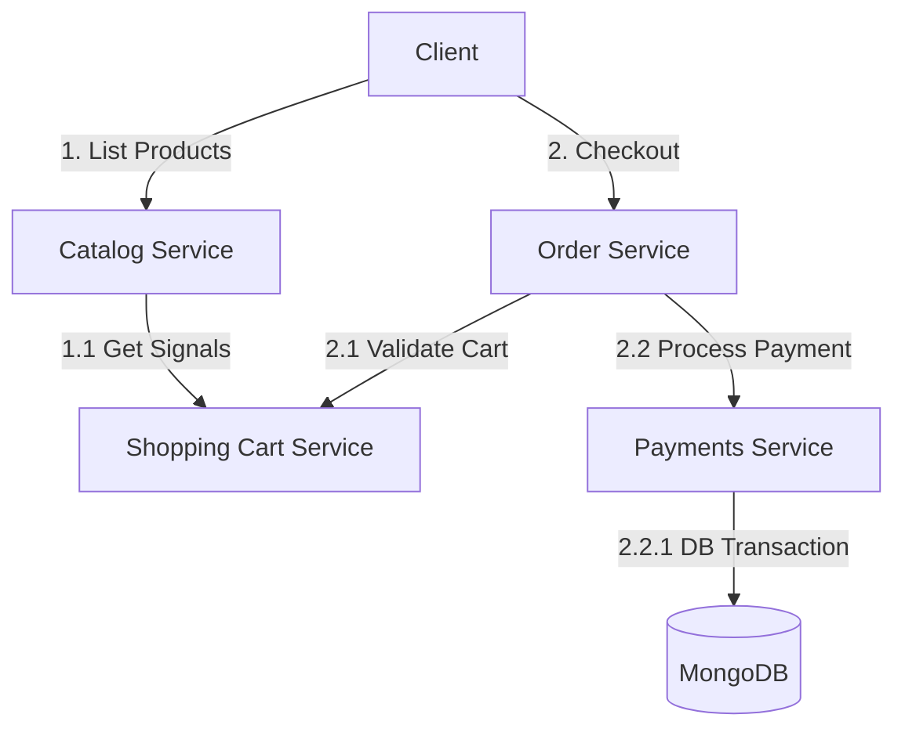

# E-Commerce Synthetic Telemetry Dataset

This dataset provides synthetic OpenTelemetry-compatible traces, metrics, and logs for a mock e-commerce microservices architecture. It includes normal baseline traffic and a simulated incident.

---

## 1. MongoDB Import Instructions

To import this telemetry dataset into your local MongoDB instance, run the following commands:

```bash
# Import Spans (Traces)
mongoimport --db telemetry --collection spans   --file spans.json

# Import Logs
mongoimport --db telemetry --collection logs    --file logs.json

# Import Metrics
mongoimport --db telemetry --collection metrics --file metrics.json
```

---

## 2. E-Commerce Service Topology & Flows

The dataset simulates a microservices architecture executing two primary business flows:



### Business Flows:
1. **Listing Flow (Read Path)**:
   - `catalog-service` serves personalized product listings by querying user cart attributes from `cart-service`.
2. **Checkout Flow (Write Path)**:
   - `order-service` orchestrates order creation, validates contents with `cart-service`, and collects payments via `payments-service` which issues transactions in the MongoDB database.

---

## 3. Data Dictionary & Observability Usage

| File Name | Signal Type | Primary Contents | Use in Health Queries | Use in Correlation & RCA |
| :--- | :--- | :--- | :--- | :--- |
| **`spans.json`** | **Traces** | Trace ID, Span ID, parent relationships, operation names, service names, start/end timestamps, duration, and status codes. | Querying latency bounds (e.g., p99 latency), error rates per endpoint, service dependency trees, and availability metrics. | Identifies *where* the latency spike or error occurred in the request call stack and traces execution paths (e.g. database query vs payment endpoint). |
| **`logs.json`** | **Logs** | Timestamps, severity levels (INFO/WARN/ERROR), service name, message content, `trace_id`, and `span_id`. | Spotting specific exception rates, database error logs, or service warnings within a time range. | Provides the *why* by matching the exact runtime error messages (e.g., Connection pool timeouts) directly to the failing trace and span. |
| **`metrics.json`** | **Metrics** | Periodic health samples (CPU, Memory utilization), service names, unit, and timestamps. | Evaluating machine-level health, CPU usage thresholds, and checking if services are running out of memory. | Correlates performance metrics (e.g., high CPU usage) with latency spikes seen in traces to confirm physical resources as the bottleneck. |

---

## 4. Planted Incident Scenario

* **Incident Window**: `14:00` to `14:45` on `26-May-2026`.
* **Root Cause**: Database Connection Pool Exhaustion in `payments-service` when connecting to `mongodb`.
* **Flow Impact**: Spiking checkout latency (3000ms+) leading to 500 error rates cascading from `mongodb` -> `payments-service` -> `order-service`.

---

## 5. Sample JSON Records

Below are example JSON records from each collection as exported:

### Span (`spans.json`)
```json
{
  "trace_id": "c159eba26d1831b838601ce7704276ae",
  "span_id": "f9b61f3ed3689048",
  "parent_span_id": "7cfd4e3e22098fc3",
  "name": "POST /payments/charge",
  "service_name": "payments-service",
  "kind": "SPAN_KIND_SERVER",
  "start_time": { "$date": "2026-05-26T09:03:50.024884Z" },
  "end_time": { "$date": "2026-05-26T09:03:50.062520Z" },
  "duration_ms": 37.64,
  "status_code": "OK",
  "status_message": "",
  "attributes": {
    "http.status_code": 200,
    "http.method": "POST",
    "http.url": "/payments/charge",
    "error.type": ""
  }
}
```

### Log (`logs.json`)
```json
{
  "timestamp": { "$date": "2026-05-26T09:03:50.000000Z" },
  "trace_id": "c159eba26d1831b838601ce7704276ae",
  "span_id": "7cfd4e3e22098fc3",
  "service_name": "order-service",
  "severity": "INFO",
  "message": "Starting checkout process for trace c159eba26d1831b838601ce7704276ae"
}
```

### Metric (`metrics.json`)
```json
{
  "timestamp": { "$date": "2026-05-26T09:00:00.000000Z" },
  "metric_name": "process.cpu.utilization",
  "service_name": "catalog-service",
  "value": 15.42,
  "unit": "1"
}
```

